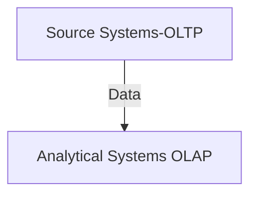

# Tipo de Sistemas
Los sistemas informáticos de información se puede dividir en categorías principales (al menos para el propósito de este blog): sistemas transaccionales y analíticos/de informes.

Los sistemas transaccionales o sistemas de registros son donde se registran los hechos del negocio:
Un cliente compra artículos.
A un paciente se le ha recetado medicación.
Se cambia el aceite de una máquina.

El enfoque de estos sistemas suele ser la consistencia y la concurrencia. No es bueno para el negocio perder o tener datos incompletos. Y muchas transacciones pueden ocurrir u ocurrirán simultáneamente, lo que significa que la concurrencia será alta.

Los sistemas analíticos / de informes son donde los datos registrados por los sistemas de registro se transfieren para ser analizados. El enfoque de este sistema es mucho almacenamiento (guardar el historial de múltiples sistemas de registros) y una alta capacidad para procesar datos. Los datos pueden provenir de varios sistemas y los informes obtenidos de esos sistemas pueden ser complejos.

## Sistemas transaccionales, Sistemas de registros (OLTP)

OLTP significa Procesamiento transaccional en línea.
OLTP es una denominación también dada a la base de datos detrás de los sistemas de registros. Una base de datos es una tecnología que almacena datos de un sistema o aplicación.
Puede usar sistemas de registros, sistemas transaccionales u OLTP casi como sinónimos. Recuerde que OLTP puede usarse más para indicar una base de datos o tecnología que un sistema.
Ejemplos de sistemas transaccionales son SAP S/4 HANA, Microsoft Dynamics, un sistema bancario, un sistema de punto de venta, etc.

## Sistemas analíticos/de informes (OLAP)

OLAP significa Procesamiento analítico en línea. OLAP es una denominación que también se le da a la base de datos detrás de Sistemas analíticos/de informes.
Ejemplos de sistemas OLAP son Azure Synapse Dedicate Pools, conjuntos de datos de Power BI (anteriormente Ms. Analysis Services), Snowflake, Google Cloud Big Query, AWS redshift, DuckDB, etc.

## El mundo no es 0s o 1s

Habiendo terminado el bachillerato y matriculado en la universidad (Ingeniería de Software en la UPSA), me di cuenta de que la vida es más complicada que sí o no, 0s y 1s. La vida sucede en el medio, lo mismo sucedió con OLTP y OLAP; al principio, era una distinción clara, pero ¿adivinen qué? Alrededor de 2014 apareció el procesamiento híbrido de transacciones/analítico (HTAP). Era un nuevo enfoque, y su concepto central era evitar mover los datos del sistema de registros al sistema Analítico, en otras palabras: Una sola base de datos que pudiera servir a ambos mundos, OLAP y OLTP.

## Antes de HTAP
Antes de HTAP, los límites eran claros:

Aquí podemos ver en la parte superior los Sistemas de registros; luego, los datos se mueven a través de un proceso llamado Extraer, Transformar o Cargar (ETL) al sistema analítico. (OLAP) Una clara distinción entre ambos tipos de sistemas. 

## Después de HTAP
 
Un enfoque fue producir una base de datos que ofreciera toda la solidez y consistencia requerida por OLTP y la alta capacidad de procesamiento de datos requerida por OLAP en un solo producto. SAP prometió esto al lanzar SAP HANA. Otro enfoque fue tener una base de datos que almacenaría cada transacción simultáneamente en dos formatos, uno optimizado para OLAP y otro para OLTP. Un ejemplo de esto es: Azure Synapse Link para SQL. En el medio de estos dos enfoques aparece también la captura de datos (CDC). La idea es la misma que para Azure Synapse Link for SQL, pero es un poco más manual. El sistema OLTP transmite todas las transacciones que ha recibido y, por otro lado, podría ser un sistema analítico el que recibe estas transacciones (casi sin demora). Al final, tienes los datos almacenados en dos lugares.