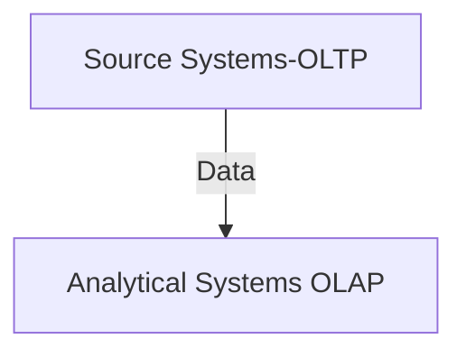

# Type of Systems
During the years system evolved into two main categories (at least for the purpose of this blog): transactional and analytical / reporting systems.

Transactional systems or systems of records are where the business events are recorded:
A customer buys items.
A patient has been prescribed medication.
The oil of a machine is changed.

The focus of these systems is usually consistency and concurrency. It won't be good for the business to lose or have incomplete data. And many transactions can or will happen simultaneously, meaning concurrency will be high. 

Analytical / reporting systems are where the data recorded by the systems of record is transferred to be analyzed. The focus of this system is a lot of storage (keeping history from multiple systems of records) and a high capacity for crunching data. Data can come from various systems, and the reports obtained from those systems can be complex.

## Transactional systems, Systems of records (OLTP)

OLTP stands for OnLine Transactional Processing.
OLTP is a denomination also given to the database behind the systems of records. A database is a technology that stores data from a system or application. 
You can use systems of records, transactional systems, or OLTP almost as synonyms. Remember that OLTP may be used more to indicate a database or technology than a system.
Examples of Transactional systems are SAP S/4 HANA, Microsoft Dynamics, a bank system, a Point of Sale system, etc.

## Analytical / Reporting Systems (OLAP)

OLAP stands for OnLine Analytical Processing. OLAP is a denomination also given to the database behind Analytical / Reporting Systems.
Examples of OLAP systems are Azure Synapse Dedicate Pools, Power BI datasets (Formerly Ms. Analysis Services), Snowflake, Google Cloud Big Query, AWS redshift, DuckDB, etc.

## The world is not 0s or 1s 

Having finished high school and enrolled in university (Software Engineering at UPSA), I came to realize that life is more complicated than yes or no, 0s and 1s. Life happens in between.The same happened with OLTP and OLAP; in the beginning, it was a clear distinction, but guess what? Around 2014 Hybrid transaction/analytical processing (HTAP) appeared. It was a new approach, and its core concept was to avoid moving the data from the system of records to the analytical system, in other words: A single database that could serve both worlds, OLAP and OLTP. 

## Before HTAP
Before HTAP, boundaries were clear:

Here we can see on the top the Systems of records; then, data is moved via a process called Extract Transform or Load (ETL) to the Analytical system. (OLAP) A clear distinction between types of systems.

## After HTAP
 
One approach was to produce a database that offered all the robustness and consistency required by OLTP and the high capacity for data crunching required by OLAP in one product. SAP promised this by releasing SAP HANA.Another approach was to have a database that would store each transaction simultaneously in two formats, one optimized for OLAP and one for OLTP. One example of this is: Azure Synapse Link for SQL. In the middle of these two approaches is changed data capture (CDC). The idea is the same as for Azure Synapse Link for SQL, but it is a bit more manual. The OLTP system broadcasts all transactions it has received, and on the other receiver side, it could be an analytical system that gets these transactions (with almost no delay). In the end, you have the data stored in two places.

## Summary OLAP vs OLTP
This table provided by SAP wiki is my favourite:

[OLAP vs OLTP](https://wiki.scn.sap.com/wiki/display/BI/OLAP+vs+OLTP)